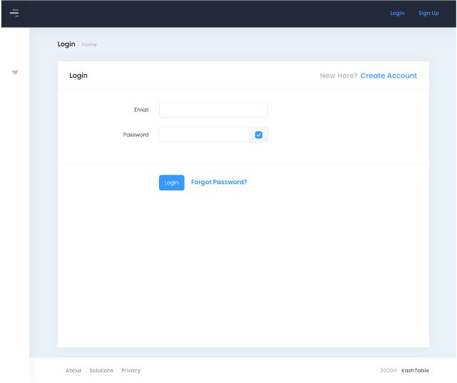

<a name="readme-top"></a>

<!-- PROJECT LOGO -->
# Kashtable

<p align="center">
  
</p>

<!-- TABLE OF CONTENTS -->
<details>
  <summary>Table of Contents</summary>
  <ol>
    <li><a href="#project-overview">Project Overview</a></li>
    <li><a href="#installation">Installation</a></li>
    <li><a href="#getting-started">Getting Started</a></li>
    <li><a href="#database-model">Database Model</a></li>
    <li><a href="#excel-formatter">Excel Formatter</a></li>
    <li><a href="#client-side">Client Side</a></li>
    <li><a href="#crud-admin">CRUD Admin</a></li>
    <li><a href="#contributing">Contributing</a></li>
    <li><a href="#license">License</a></li>
    <li><a href="#reference">Reference</a></li>
  </ol>
</details>

# Project Overview

Welcome to **Kashtable**, our financial SaaS platform—a powerful Python-based solution designed to tackle complex financial challenges with ease.

* **Flask Integration**: Seamlessly blends `Flask` to craft a scalable, robust web application, ensuring swift responses to user needs.
* **Data Manipulation**: Empowers users with extensive data analysis and manipulation, providing insights that drive strategic decisions.
* **Database Management**: Leverages a lightweight, high-reliability `SQL` database engine, ensuring data integrity and performance.
* **Interactive Visualizations**: Elevates user experience with `Highcharts`, offering dynamic, visually engaging data representations that enhance comprehension.

Our platform is engineered to address critical issues:

* **Liquidity Management**: Navigate uncertain economic landscapes with confidence, resolving liquidity challenges effectively.
* **Performance Optimization**: Maintain healthy EBITDA and closely monitor key performance drivers.

Achieve your financial goals effortlessly through:

* **Diagnostic Tools**: Identify and address financial bottlenecks swiftly.
* **Comprehensive Reporting**: Generate insightful financial reports effortlessly.
* **Business Driver Analysis**: Gain deep insights into the factors impacting your business performance.
* **Advanced Financial Analysis**: Conduct thorough financial evaluations with ease.
* **Enhanced Visibility**: Get a clear view of your financial landscape for informed decision-making.
* **Forecasting Capabilities**: Anticipate future trends and plan accordingly.
* **Integrated SaaS Solutions**: Seamlessly integrate our platform into your existing infrastructure.
* **Robust Security Measures**: Rest easy knowing your sensitive financial data is well-protected.

<p align="right">(<a href="#readme-top">back to top</a>)</p>

# Installation

To get started with **Kashtable**, we recommend using `poetry`:

1. **Clone the Repository**
    ```sh
    git clone https://github.com/your-username/kashtable.git
    ```

2. **Install `poetry`**
   
    If you don't have `poetry` installed, you can install it by following the instructions on the [Poetry website](https://python-poetry.org/docs/#installation).
    ```sh
    curl -sSL https://install.python-poetry.org | python3 -
    ```

3. **Create a Virtual Environment**
    ```sh
    poetry lock
    ```

4. **Install Dependencies**
   ```sh
   poetry install
   ```

5. **Activate the Virtual Environment**
    ```sh
    poetry shell
    ```

6. **Run the Application**
   
   From your terminal:
    ```sh
    poetry run flask run --debug
    ```
    From Python:
    ```python
    >>> from kashtable import create_app
    >>> app = create_app()
    >>> app.run(debug=True)
    ```

<p align="right">(<a href="#readme-top">back to top</a>)</p>

# Getting Started

Here is a quick guide to get you started with **Kashtable**:

1. **Register an Account**: Sign up for a new account on the platform.
2. **Log In**: Use your credentials to log in to the platform.
3. **Upload Data**: Navigate to the upload section and import your financial data.
4. **Analyze**: Utilize the platform's tools to analyze your data and generate reports.
5. **Visualize**: Create dynamic charts and graphs to visualize your financial performance.

### Example Walkthrough

#### Registering an Account
To begin using **Kashtable**, first register an account. Fill out the registration form with your company and personal details, ensuring all mandatory fields are completed.

#### Logging In
Once registered, log in using your email and password. If you forget your password, use the 'Forgot Password' feature to reset it.

#### Uploading Data
Navigate to the 'Upload Data' section. Here, you can import your financial data files. Supported formats include `.xls`, `.xlsx`, and `.csv`. Ensure your data is correctly formatted to match the template provided by the platform.

#### Analyzing Data
After uploading your data, head to the 'Analyze' section. Utilize tools like trend analysis, variance analysis, and ratio analysis to gain insights into your financial performance.

#### Visualizing Data
Create visually engaging reports using the 'Visualize' section. Choose from various chart types like line charts, bar charts, and pie charts to represent your data effectively.

<p align="right">(<a href="#readme-top">back to top</a>)</p>

# Database Model

Our platform's database model is designed to enable extensive data analysis and manipulation, providing insights that drive strategic decisions. 

### Connecting a `Flask` Application to an `SQLite` Database

To connect a `Flask` application to an `SQLite` database for the first time:

```python
>>> from kashtable import create_app, db
>>> create_app().app_context().push()
>>> db.create_all()
# CREATE TABLE user ( ...
# CREATE TABLE file ( ...
```

### Database Structure

#### User Table

| Field         | Type        | Description      |
|---------------|-------------|------------------|
| Id (PK)       | int         | Primary Key      |
| Type          | str         | User Type        |
| Company name  | str         | Company Name     |
| Street        | str         | Street Address   |
| Postcode      | str         | Postal Code      |
| City          | str         | City             |
| Country       | str         | Country          |
| Siren         | str         | Siren Number     |
| First name    | str         | First Name       |
| Last name     | str         | Last Name        |
| Email         | email       | Email Address    |
| Phone number  | str         | Phone Number     |
| Image file    | str         | Image File Path  |
| Bundle        | int         | Bundle ID        |
| Activated     | bool        | Activation Status|
| Password      | str         | Password         |

#### File Table

| Field         | Type        | Description       |
|---------------|-------------|-------------------|
| Id (PK)       | int         | Primary Key       |
| Name          | str         | File Name         |
| Doc           | pickle      | Document (Pickle) |
| Date          | datetime    | Date Uploaded     |
| User Id       | int         | Foreign Key (User)|

### Relationships

The `User` and `File` tables are linked through the `User Id` foreign key, allowing each file to be associated with a specific user.

| Foreign Key  | References  | Description                         |
|--------------|-------------|-------------------------------------|
| User Id      | User(Id)    | Connects File to User by User Id    |

<p align="right">(<a href="#readme-top">back to top</a>)</p>

# Excel Formatter

Our Excel Formatter module provides a structured template and efficient formatting mechanism, streamlining data entry and analysis processes.

## Template

| Field Name                                          |
|-----------------------------------------------------|
| `table_name`                                        |
| `font_weight`                                       |
| `font_color`                                        |
| `background_color`                                  |
| `font_family`                                       |
| `font_size`                                         |
| `text_align`                                        |

## Table Overview

| Field Name              | Type                | Options/Description                                  |
|-------------------------|---------------------|------------------------------------------------------|
| `table_name`              | `List[str]`    | - Compte de Resultat Analytique Cumulé<br>- Compte de Resultat Analytique Courant<br>- Flux de Trésorerie Historique Direct<br>- Flux de Trésorerie Historique Indirect<br>- Bilan<br>- Budget<br>- Prévision de Trésorerie                                                                                |
| `font_weight`             | `str`       | - normal<br>- bold<br>- italic                             |
| `font_color`, `background_color` | `str`  | - Color name<br>- Hex                                    |
| `font_family`             | `str`       | - Any font family                                          |
| `font_size`               | `str`       | - Pixel (px)<br>- Percentage (%)                           |
| `text_align`              | `str`       | - right<br>- left<br>- center                              |


<p align="right">(<a href="#readme-top">back to top</a>)</p>

# Client Side

The client side of **Kashtable** is designed to provide a seamless and user-friendly experience for interacting with the platform. Users can easily manage their profiles, upload data, and visualize financial reports. The client-side interface is built to ensure smooth navigation and efficient use of all the platform's features.

## Access

### Register

Users can create a new account by filling out the registration form. This form requires basic information such as the user's name, email, and password. After completing the form, users receive a confirmation email to verify their account.

<p align="center">
  
</p>

### Login

Existing users can log in using their credentials. The login page provides fields for email and password. If a user forgets their password, they can click the "Forgot Password" link to reset it.

<p align="center">
  
</p>

### Reset Password

Users can reset their password if they forget it. This involves entering their email address, receiving a reset link, and creating a new password.

<p align="center">
  
</p>

### Aside

The sidebar provides navigation options, tailored for both authenticated and unauthenticated users.

#### Not Authenticated

The sidebar for unauthenticated users offers limited access, typically including links to the home page, about section, and registration/login pages.

<p align="center">
  
</p>

#### Authenticated

The sidebar for authenticated users includes access to all features, such as profile management, data upload, and analysis tools.

<p align="center">
  
</p>

## Profile

Users can view and edit their profile information. This includes personal details like name, email, and contact information, as well as company details.

<p align="center">
  
</p>

## Upload

The file upload functionality allows users to import financial data files to the platform for analysis. Users can select files from their local system and upload them to their account.

<p align="center">
  
</p>

## Posts

### Home

The home page displays an overview of recent activities and updates, providing users with a quick snapshot of their financial data and analysis.

<p align="center">
  
</p>

### Table

Users can view their uploaded data in tabular format. This feature allows users to inspect their data for accuracy and completeness before performing any analysis.

<p align="center">
  
</p>

## Charts

Users can create and view dynamic charts to visualize their financial data. This feature supports various chart types, including line charts, bar charts, and pie charts, making it easy to identify trends and patterns.

<p align="center">
  
</p>

<p align="right">(<a href="#readme-top">back to top</a>)</p>

# CRUD Admin

The CRUD (Create, Read, Update, Delete) Admin section of **Kashtable** allows administrators to manage users and files efficiently. This section provides a comprehensive interface to perform all necessary administrative tasks, ensuring smooth operation and maintenance of the platform.

## Home

The admin home page provides an overview of administrative options and system status. It includes quick links to user and file management sections.

## User

### List

Administrators can view a list of all users registered on the platform. This list includes user details such as name, email, and registration date.

<p align="center">
  
</p>

### Create

Administrators can add new users by filling out the user creation form. This form requires details such as the user's name, email, and password.

### Details

Detailed information about each user can be viewed. This includes their profile information, account status, and any associated files.

### Edit

Administrators can edit user information as needed. This includes updating contact details, changing account status, and resetting passwords.

## File

### List

Administrators can view a list of all files uploaded to the platform. This list includes file names, upload dates, and associated users.

<p align="center">
  
</p>

### Create

Administrators can upload new files to the platform. This feature is useful for adding sample data or importing data on behalf of users.

### Details

Detailed information about each file can be viewed. This includes file metadata, content preview, and user associations.

<p align="right">(<a href="#readme-top">back to top</a>)</p>

# Contributing

We welcome contributions from the community! If you have a feature request, bug report, or want to contribute code, please follow these steps:

1. **Fork the Repository**
   Create a personal copy of the repository by clicking the 'Fork' button.

2. **Clone Your Fork**
   Clone your forked repository to your local machine:
    ```sh
    git clone https://github.com/your-username/kashtable.git
    ```

3. **Create a Feature Branch**
   Create a new branch for your feature or bugfix:
    ```sh
    git checkout -b feature/YourFeature
    ```

4. **Commit Your Changes**
   Make your changes and commit them with a meaningful message:
    ```sh
    git commit -m 'Add some feature'
    ```

5. **Push to the Branch**
   Push your changes to your forked repository:
    ```sh
    git push origin feature/YourFeature
    ```

6. **Open a Pull Request**
   Open a pull request on the original repository, describing your changes in detail.

For more details, please refer to our [CONTRIBUTING.md](CONTRIBUTING.md) file.

<p align="right">(<a href="#readme-top">back to top</a>)</p>

# License

Distributed under the BSD-3 License. See `LICENSE.txt` for more information.

<p align="right">(<a href="#readme-top">back to top</a>)</p>
